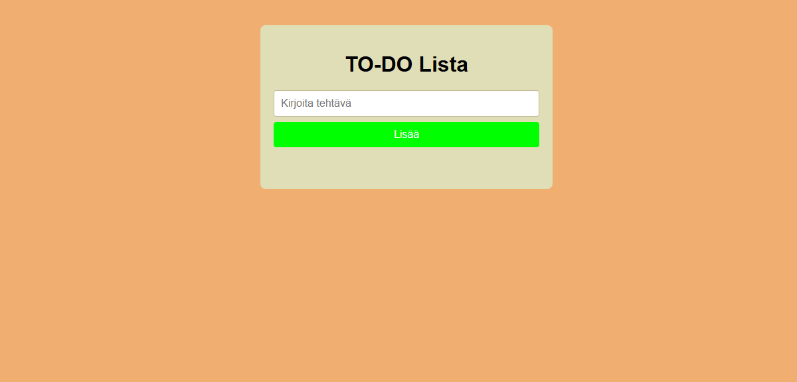
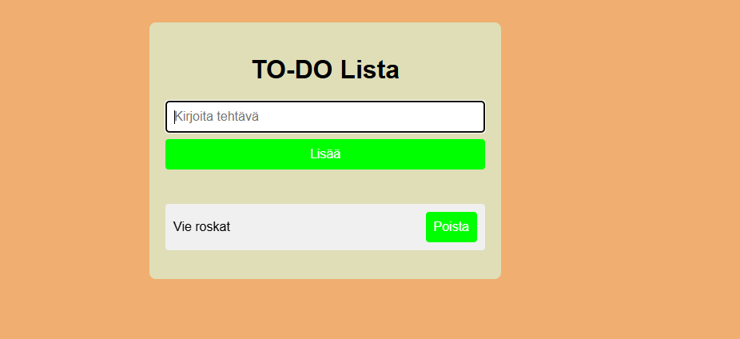
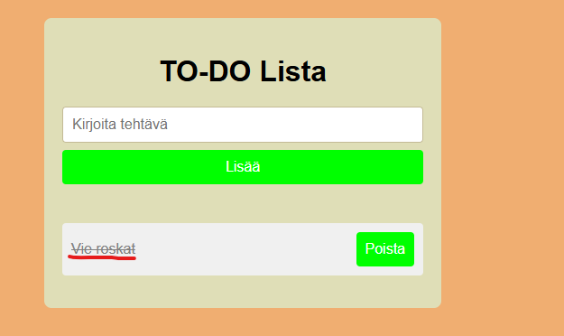

To-Do lista/ Checklist projekti
Teemu Hyppönen

Verkkolinkit:
Pääset julkaistuun sovellukseen käsiksi osoitteessa [google.com](https://teemu1337.github.io/Dom-scriptaus-projekti) Linkki projektin videoesittelyyn [google.com](https://video.laurea.fi/media/To-Do%20list%20sovellus%20videoraportti/0_3kfa2n6g)

Oma arvio työstä ja oman osaamisen kehittymisestä
Mielestäni onnistuin hyödyntämään edellisistä workshopeista oppimiani taitoja projektissa Parantamista olisi kyllä vielä virheettömän koodin kirjoittamisessa. Sovelluksesta jäi puuttumaan hieman "eloisuutta". Olisin voinut lisätä hieman extra ominaisuuksia, mutta rajallisen ajan takia päätin pitää sovelluksen simppelinä ja käyttää lopun ajan korjailuun ja siistimiseen. Koen, että olen oppinut käyttämään DOM scriptausta ja erilaisia javascript ominaisuuksia luodakseni toimivam verkkosovelluksen. Epäselväksi ei oikeastaan jäänyt mikään sillä pidin sovelluksen tosi yksinkertaisena helpottamaan tekoa ja virheiden löytämistä. Antaisin itselleni pisteitä seuraavasti: 2-3/5

Palaute opettajalle kurssista sekä itse opetuksesta tähän saakka
Kurssi sekä lähiopetus ovat tuntuneet ihan opettavaisilta. Mielestäni teoriaosuudet olivat opettavaisia ja diat auttoivat tosi paljon workshoppien tekemisessä. 

Tietoja sovelluksesta: Sovellus on yksinkertainen To-Do lista, jossa voit lisätä tehtäviä, yliviivata ja poistaa ne.

Kuvakaappaukset:

To-Do List on sovellus, joka antaa sinun listata tehtäviä alapuolelle ja yliviivata ne kun olet saanut ne valmiiksi. Sovellus antaa sinun myös poistaa näitä tehtäviä, jotta ne eivät jää sinne lojumaan.

Sovellus on niin simppeli ettei siinä oikeastaan ole mitään bugeja tai en ainakaan itse ole huomannut sellaisia.

Teknologiat
Käytin tässä projektissa hmtl5 (esim. local storage), css, JavaScript, DOM API, github

Asennus
Avaa linkki readme:n alku kohdasta tai avaa index html esim. visual studio coden kautta omalle selaimellesi.
...
Kiitokset:
Mika Stenbergille hyvästä opetuksesta ja edellisistä workshopeista ja dioista, jotka auttoivat hyvin paljon tämän projektin tekemisessä.

Ws3Schools 2025. JavaScript and HTML DOM. Viitattu 21.10.2025
https://www.w3schools.com/jsref/default.asp

Käytin myös ChatGPT:tä esimerkiksi virheiden löytämiseen. Se on kätevää kun koodi näyttää täydelliseltä, mutta ei toimikaan(esim. pilkku puuttuu). Opin myös hyödyntämään "DOMContentLoaded" komentoa, sekä "Date.now()" käyttämistä ID:nä luomaan uniikin luvun, joita olen käyttänyt myös osassa workshopeissa eli opin tekoälyn hyödyntämisessä uuttakin.

Teemu Hyppönen
Simple To-Do List
TODO-lisenssi @ Teemu Hyppönen
